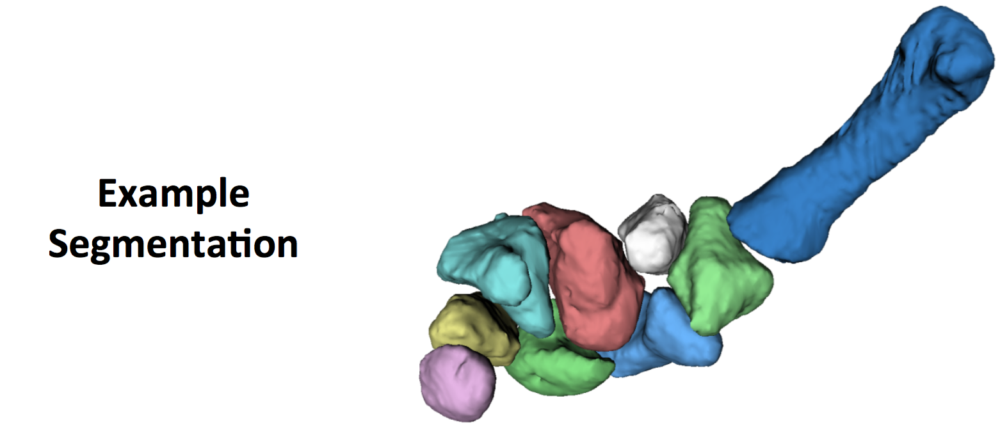
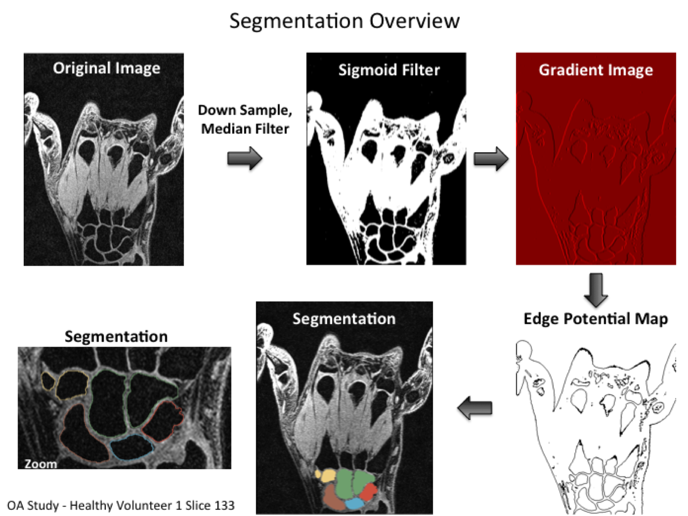
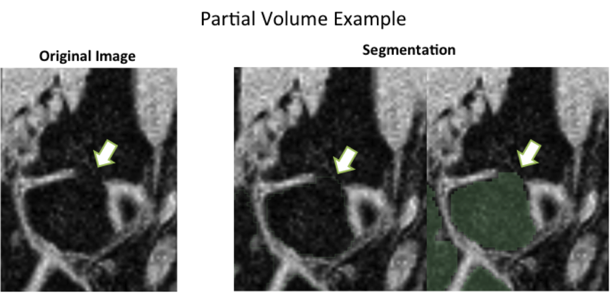
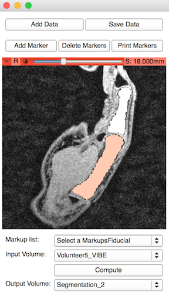
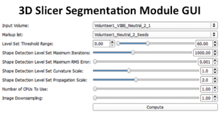

BoneSegmentation 
=============

<p align="center">

</p>

Purpose 
-------

Segment the carpal bones from MR images given a set of user defined locations (seed points) within the image. It utilizes the open source [SimpleITK](http://www.simpleitk.org/) library which is a python wrapper for many [ITK](http://www.itk.org/) functions which are mainly implemented in C++. 

BoneSegmentation currently uses the [Confidence Connected Image Filter](http://www.itk.org/SimpleITKDoxygen/html/classitk_1_1simple_1_1ConfidenceConnectedImageFilter.html) along with some post-processing on the binary image to fill holes/smooth edges. Pre-processing to enhance edges and decrease the chances of leaking into the background will be added.


Segmentation Overview
-------

<p align="center">

</p>

<p align="center">

</p>

Usage
-------


## To use as a Sliclet Application:

```
$/path/to/Slicer.exe --no-main-window --python-script /path/to/BoneSegmentation.py 
```

* Load image by the **Add Data** button (any Slicer acceptable image format can be used including Analyze and DICOM)
* Enable added fiducial markers (i.e. seed point) by clicking on the *Add Marker* button
* Add one seed point for each bone of interest 
* Select the volume in the **Input Volume** and click on **Compute**
* The segmentation will take ~45 seconds and will appear as a label type image overlaid onto the original image
* Save the segmentation by the **Save Data** button and selecting the corresponding image


<p align="center">

</p>

## To use as a Slicer Module:

* Open Slicer
* Edit -> Application Settings -> Modules
* Copy and paste both .py (python) files into the module path
* Or add a path to the folder using the "Additional Module Paths"
* Restart Slicer (the GUI is created on start up so restarting is needed when aded a new module)
* Use the fiduical marker module to create the seed points
* Select the volume in the **Input Volume** and click on **Compute**
* The segmentation will take ~45 seconds and will appear as a label type image overlaid onto the original image


<p align="center">

</p>


Install Python Requirements
-------
Install pip (installation manager for adding python libraries)
```
python get-pip.py
```

Use the Requirements.txt to install only the needed libraries. This will also check the version number and update if needed.
```
pip install -r /path/to/requirements.txt
```

## Build Commands


### Create Python Requirements.txt


```
$pipreqs /path/to/project
```


### Build Documentation using Sphinx

``` 
cd /Documentation
make html
```

### Build Documentation using Doxygen


Use the Doxygen GUI (will use commands later if needed). Sphinx may be preferred

### Version Number

Will be following the [Semantic Versioning convention](http://semver.org/) where a given version number is  MAJOR.MINOR.PATCH, increment when:

0. MAJOR version when you make incompatible API changes,
0. MINOR version when you add functionality in a backwards-compatible manner, and
0. PATCH version when you make backwards-compatible bug fixes.

Additional labels for pre-release and build metadata are available as extensions to the MAJOR.MINOR.PATCH format.

Note: Use the following commands to create a version tag in the git repository (it doesn't automatically upload the tag so I'm not sure how frequently the push to remote tag needs to happen). See the [Git documentation](https://git-scm.com/book/en/v2/Git-Basics-Tagging) as a reference.
```
git tag v0.1.0
git push origin v0.1.0
```


### Github Flow

Branches will (hopefully) roughly follow this github work flow with three branches 

0. **Master** branch that always contains working code (validated and sharable)
0. **Release** branch when working towards the next version (stable code)
0. **Develop** branch for adding and fixing features (not ready for sharing and may not work yet)


<p align="center">

</p>
